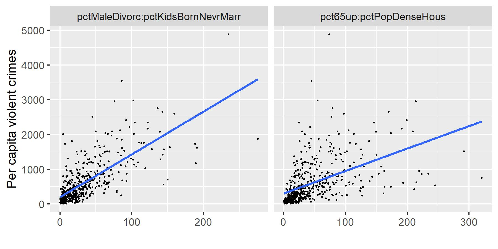

```{r, echo=FALSE, message=FALSE, warning=FALSE}
knitr::opts_chunk$set(warning = FALSE, eval = TRUE, message = FALSE)
```


## Brief introduction       
The R package `abess` implement a polynomial algorithm [\color{blue}{paper}](https://www.pnas.org/content/117/52/33117) for solving the best-subset selection problem:
$$\min_{\boldsymbol{\beta} \in \mathbb{R}^p} \mathcal{L_n}({\boldsymbol\beta}), \text{ s.t. } \|\boldsymbol\beta\|_0 \leq s,$$
where $\mathcal{L}_{n}(\boldsymbol \beta)=\frac{1}{2 n}\|y-X \boldsymbol{\beta}\|_{2}^{2}$, $\|\boldsymbol{\beta}\|_0=\sum_{i=1}^pI( \boldsymbol{\beta}_i\neq 0)$ is the $\ell_0$(-pseudo) norm of $\beta$, and the sparsity level $s$ is usually an unknown non-negative integer.
Next, we present an example to show how to use the `abess` package to solve a simple problem. 

## Quick example        
### Fixed support size best subset selection        
We generate a design matrix $X$ containing 300 observations and each observation has 1000 predictors. The response variable $y$ is linearly related to the first, second, and fifth predictors in $X$: 
$$y = 3X_1 + 1.5X_2 + 2X_5 + \epsilon,$$
where $\varepsilon$ is a standard normal random variable. 
```{r}
library(abess)
synthetic_data <- generate.data(n = 300, p = 1000, 
                                beta = c(3, 1.5, 0, 0, 2, rep(0, 995)))
dim(synthetic_data[["x"]])
head(synthetic_data[["y"]])
dat <- cbind.data.frame("y" = synthetic_data[["y"]], 
                        synthetic_data[["x"]])
```

Then, we use the main function `abess` in the package to fit this dataset. 
By setting the arguments `support.size = s`, `abess()` function conducts **Algorithm 1** [\color{blue}{paper}](https://www.pnas.org/content/117/52/33117) for the best-subset selection with a sparsity level `s`. In our example, we set the options: `support.size = 3`, and we run **Algorithm 1** with the following command: 
```{r}
abess_fit <- abess(y ~ ., data = dat, support.size = 3)
```
    
The output of `abess` comprises the selected best model: 
```{r}
head(coef(abess_fit, sparse = FALSE))
```
The support set of the best model is identical to the ground truth, and the coefficient estimation is the same as the oracle estimator given by `lm` function:
```{r}
lm(y ~ ., data = dat[, c(1, c(1, 2, 5) + 1)])
```

<!-- Users could `print`, `summary` or `predict` this bestmodel object just like working with classical regression modeling. This would be helpful for data scientists who are familiar with `lm` functions in R. -->

### Adaptive best subset selection        
Supposing we are unknown about the true sparsity level in real world data, and thus, we need to determine the most proper one. The **Algorithm 3** [\color{blue}{paper}](https://www.pnas.org/content/117/52/33117) is designed for this scenario. `abess` is capable of performing this algorithm: 
```{r}
abess_fit <- abess(y ~ ., data = dat)
```

The output of `abess()` also comprises the selected best model: 
```{r}
best_size <- abess_fit[["best.size"]]
print(best_size)
head(coef(abess_fit, support.size = best_size, sparse = FALSE))
```
The output model accurately detect the true model size, which implies the **Algorithm 3** efficiently find both the optimal sparsity level and true effective predictors.

## Real data example
### Hitters Dataset
In this tutorial, we are going to demonstrate how to use the `abess` package to carry out best subset selection on the `Hitters` dataset. 
We hope to use several predictors related to the performance of the baseball athletes last year to predict their salary.
First, let's have a look at this dataset. There are 19 variables except `Salary` and 322 observations.

```{r}
Hitters <- read.csv("Hitters.csv", header = TRUE)
head(Hitters)
dim(Hitters)
sum(is.na(Hitters))
```
Note that this dataset contains some missing data. So we use the `na.omit()` function to delete rows that have incomplete information. After that, we have 263 observations remaining.
```{r}
Hitters <- na.omit(Hitters)
dim(Hitters)
sum(is.na(Hitters))
```
Then we change the factors into dummy variables with the `model.matrix()` function. Note that the `abess()` function will automatically include the intercept.

```{r}
Hitters <- model.matrix(~., Hitters)[, -1]
Hitters <- as.data.frame(Hitters)
```

### Running ABESS
The `abess()` function in the `abess` package allows you to perform best subset selection in a highly efficient way. You can call the `abess()` function using formula just like what you do with `lm()`. Or you can specify the design matrix `x` and the response `y`. The `system.time()` function records the run time.
```{r}
library(abess)
abess_fit <- abess(Salary ~ ., Hitters)
abess_fit <- abess(Hitters[, -which(colnames(Hitters) == "Salary")], Hitters$Salary)
class(abess_fit)
```

### Interpret the Result

After get the estimator, we can further do more exploring work.
The output of `abess()` function contains the best model for all the candidate support size in the `support.size`. You can use some generic function to quickly draw some information of those estimators.
```{r}
# draw the estimated coefficients on all candidate support size
coef(abess_fit)

# get the deviance of the estimated model on all candidate support size
deviance(abess_fit)

# print the fitted model
print(abess_fit)
```

Prediction is allowed for all the estimated models. Just call `predict.abess()` function with the `support.size` set to the size of model you are interested in. If `support.size` is not provided, prediction will be made on the model with best tuning value.   
```{r}
hitters_pred <- predict(abess_fit, 
                        newx = Hitters[, -which(colnames(Hitters) == "Salary")], 
                        support.size = c(3, 4))
head(hitters_pred)
```

The `plot.abess()` function helps to visualize the change of models with the change of support size. There are 5 types of graph you can generate, including `coef` for the coefficient value, `l2norm` for the L2-norm of the coefficients, `dev` for the deviance and `tune` for the tuning value. Default if `coef`.
```{r}
plot(abess_fit, label = TRUE)
```

The graph shows that, beginning from the most dense model, the 15th variable (Division, A factor with levels E and W indicating player's division at the end of 1986) is included in the active set until the support size reaches 3.

We can also generate a graph about the tuning value. Remember that we used the default GIC to tune the support size. 
```{r}
plot(abess_fit, type = "tune")
```

The tuning value reaches the lowest point at 6. And We might choose the estimated model with support size equals 6 as our final model. In fact, the tuning values of different model sizes are provided in `tune.value` of the `abess` object. You can get the best model size through the following call.   
```{r}
extract(abess_fit)[["support.size"]]
```

To extract any model from the `abess` object, we can call the `extract()` function with a given `support.size`. If `support.size` is not provided, the model with the best tuning value will be returned. Here we extract the model with support size equals 6.
```{r}
best.model <- extract(abess_fit, support.size = 6)
str(best.model)
```

The return is a list containing the basic information of the estimated model.

## Advanced features        
### Feature screening for ultra-high dimensional dataset       
The [\color{blue}{
communities-and-crime dataset}](https://archive.ics.uci.edu/ml/datasets/communities+and+crime) consists of 18 variables about crime from the 1995 FBI UCR (e.g., per capita arson crimes and per capita violent crimes), communities information in the U.S. (e.g., the percent of the population considered urban), socio-economic data from the 90s census (e.g., the median family income), and law enforcement data from the 1990 law enforcement management and admin stats survey (e.g., per capita number of police officers). It would be appropriate if any of the crime state in community can be modeled by the basic community information, socio-economic and law enforcement state in community. 
Here, without the loss of generality, per capita violent crimes is chosen as the response variable, and 102 numerical variables as well as their pairwise interactions is considered as predictors.
<!-- Note that, the numerical variables with at least 50\% percentages missing observations are excluded,  -->
<!-- and 200 observations without missing records are randomly picked out from the pool.  -->
The pre-processed dataset for statistical modeling has 200 observations and 5253 predictors, and the code for pre-processing are openly shared in [\color{blue}{https://github.com/abess-team/abess/blob/master/R-package/data-raw/DATASET_VIGNETTES.R}](https://github.com/abess-team/abess/blob/master/R-package/data-raw/DATASET_VIGNETTES.R).   
The pre-processed dataset can be freely downloaded by running:
```{r}
working_directory <- getwd()
if (file.exists("crime.rda")) {
  load("crime.rda")
} else {
  crime_data_url <- "https://github.com/abess-team/abess/raw/master/R-package/data-raw/crime.rda"
  download.file(crime_data_url, "crime.rda")
  load(file.path(working_directory, "crime.rda"))
}
```
As mentioned before, this dataset comprises 5000+ features, much larger than the number of observations:
```{r}
dim(crime)
```
And thus, it would be better to first perform feature screening, 
which is also supported by the `abess` function. 
Suppose we are interested in retaining 1000 variables with the largest marginal utility, then we can conduct the command:       

```{r}
abess_fit <- abess(y ~ ., data = crime, screening.num = 1000)
str(abess_fit)
```
The returned object of `abess` includes the features selected by screening. We exhibit six variables of them:
```{r}
head(abess_fit[["screening.vars"]])
```
Then, by the generic `extract` function, we can obtain the best model detected by `ABESS` algorithm, and get the variables in the best model: 
```{r}
best_model <- extract(abess_fit)
str(best_model)
best_vars <- best_model[["support.vars"]]
best_vars
```
<!-- From the linear model based on the selected features, we see that the two predictors,  -->
<!-- 'pctMaleDivorc:pctKidsBornNevrMarr'  -->
<!-- (i.e., the linear interaction between the percentage of divorced males and the percentage of kids born to never married)  -->
<!-- and 'pct65up:pctPopDenseHous'  -->
<!-- (i.e., the linear interaction between the percentage of population that is 65 at least in age and the percent of persons in dense housing that have more than 1 person per room), have the most significant impact on the response:  -->
```{r, eval=FALSE, echo=FALSE}
lm_dat <- cbind.data.frame(crime[, c("y", best_vars)])
lm_fit <- lm(y ~ ., data = lm_dat)
summary(lm_fit)
```
<!-- We visualize the relationship between the response and the  -->
<!-- two most significant -->
<!-- selected predictors: -->
<!--  -->
```{r, fig.height=3, fig.width=6, echo=FALSE, eval=FALSE}
library(reshape2)
library(ggplot2)
pdat <- crime[, c("y", 
                  "pctMaleDivorc:pctKidsBornNevrMarr",
                  "pct65up:pctPopDenseHous")]
pdat <- melt(pdat, id.vars = "y")
p <- ggplot(pdat) + geom_point(aes(value, y), size = 0.3) + 
  geom_smooth(aes(value, y), method = "lm", se = FALSE) +
  facet_wrap(. ~ variable, scales = "free_x") + 
  xlab("") + ylab("Per capita violent crimes") 
p
ggsave(p, filename = "crime.jpg", height = 3, width = 6)
```

```{r, fig.height=6, fig.width=9, echo=FALSE, eval=FALSE}
library(reshape2)
library(ggplot2)
pdat <- melt(lm_dat, id.vars = "y")
p <- ggplot(pdat) + geom_point(aes(value, y), size = 0.3) + 
  geom_smooth(aes(value, y), method = "lm", se = FALSE) +
  facet_wrap(. ~ variable, scales = "free_x") + 
  xlab("") + ylab("Per capita violent crimes") 
p
```


```{r, echo=FALSE, eval=FALSE}
working_directory
file.remove("crime.rda")
```

### More features           
There are plenty features provided by `abess` packages such as logistic regression and group selection. 
Please the other articles in our website for more details. 

