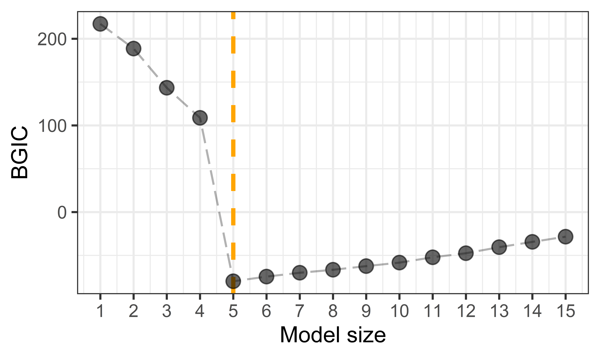

```{r setup, include=FALSE}
knitr::opts_chunk$set(echo = TRUE)
```

## Introduction

The generic splicing technique certifiably guarantees the best subset can be selected in a polynomial time.
In practice, the computational efficiency can be improved to handle large scale datasets.
The tips for computational improvement include:      

- exploit sparse structure of input matrix; 
- use golden-section to search best support size;         
- early-stop scheme;        
- sure independence screening;            
- warm-start initialization;            
- parallel computing when performing cross validation;        
- covariance update for `family = "gaussian"` or `family = "mgaussian"`;            
- approximate Newton iteration for `family = "binomial"`, `family = "poisson"`, `family = "cox"`.    

This vignette illustrate the first three tips. 
For the other tips, they have been efficiently implemented and set as the default in abess package. 

## Sparse matrix           
We sometimes meet with problems where the $N \times p$ input matrix $X$ is extremely sparse, i.e., many entries in $X$ have zero values.
A notable example comes from document classification: aiming to assign classes to a document, making it easier to manage for publishers and news sites.
The input variables for characterizing documents are generated from a so called ``bag-of-words'' model. 
In this model, each variable is scored for the presence of each of
the words in the entire dictionary under consideration. 
Since most words are absent, the input variables for each document
is mostly zero, and so the entire matrix is mostly zero. 
Such sparse matrices can be efficiently stored in R with a *sparse column format* via the [Matrix](https://cran.r-project.org/web/packages/Matrix) package. 
And the sparse matrix can be directly used by our **abess** package for boosting the computational efficient. 

ABESS algorithm is ideally set up to exploit such sparsity. The $O(N)$ inner-product operations when computing forward sacrifice can exploit the sparsity,
by summing over only the non-zero entries. 
For computing backward sacrifice, the sparsity also facilitate solving the convex optimization under a given support set. 
The following example demonstrates the efficiency gain from the sparse matrix. 
We first generate a input matrix whose 90% entries are 0.
```{r}
require(Matrix)
num <- 1000
p <- 100
sparse_ratio <- 0.9
x <- matrix(rnorm(num * p), nrow = num)
zero_entry <- matrix(rbinom(num * p, size = 1, prob = sparse_ratio), nrow = num)
x[zero_entry == 1] <- 0
y <- x %*% matrix(c(rep(3, 5), rep(0, p - 5)))
x <- Matrix(x)
head(x[, 1:10])
```
Then, we apply ABESS algorithm on Matrix `x` and record the runtime in `t1`:
```{r}
library(abess)
t1 <- system.time(abess_fit <- abess(x, y))
```

We compare the runtime when the input matrix is dense matrix:
```{r}
x <- as.matrix(x)
head(x[, 1:6])
t2 <- system.time(abess_fit <- abess(x, y))
rbind(t1, t2)[, 1:3]
```

From the comparison, we see that the time required by sparse matrix is visibly smaller, 
and thus, we suggest to assign a sparse matrix to `abess` when the input matrix have a lot of zero entries. 

## Golden-section searching           

The following is a typical ``model size v.s. BGIC'' plot.        
{width=80%}
      
The $x$-axis is model size, and the $y$-axis is BGIC's value recorded in group splicing algorithm for linear model.
The entries of design matrix $X$ are *i.i.d.* sampled from $\mathcal{N}(0, 1)$, and the matrix shape is $100 \times 200$.
The error term $\varepsilon$ are *i.i.d.* $\mathcal{N}(0, \frac{1}{2})$.
Take the two adjacent variables as one group, and set the true coefficients $\beta=(1, 1, 1, 1, 1, 1, -1, -1, -1, -1, 0, \ldots, 0)$.
The orange vertical dash line indicates the true group subset size.

From this Figure, we see that the BGIC decreases from $T=1$ to $T=5$, but it increases as $T$ larger than $5$.
In other words, the BGIC path of SGSplicing algorithm is a strictly unimodal function achieving minimum at the true group subset size $T = 5$.
Motivated by this observation, we suggest to recruit a heuristic search based on the golden-section search technique, an efficient method for finding the extremum of a unimodal function, to determine support size that minimizing BGIC. Compared with searching the optimal support size one by one from a candidate set with $O(s_{\max})$ complexity, golden-section reduce the time complexity to $O(\ln{(s_{\max})})$, giving a significant computational improvement. 

The code below exhibits how to employ the golden search technique with abess package: 
```{r}
synthetic_data <- generate.data(n = 500, p = 100, 
                                beta = c(3, 1.5, 0, 0, 2, rep(0, 95)))
dat <- cbind.data.frame("y" = synthetic_data[["y"]], 
                        synthetic_data[["x"]])
t1 <- system.time(abess_fit <- abess(y ~ ., data = dat, tune.path = "gsection"))
str(extract(abess_fit))
```

The output of golden-section strategy suggests the optimal model size is accurately detected. 
Compare to the sequential searching, the golden section reduce the runtime because 
it skip some support sizes which are likely to be a non-optimal one: 

```{r}
t2 <- system.time(abess_fit <- abess(y ~ ., data = dat))
rbind(t1, t2)[, 1:3]
```

## Early stop   
In machine learning, early stopping is a helpful strategy not only avoid overfitting but also reducing training time. 
For the early-stopping implementation in abess, validation is used to detect when overfitting starts during performing adaptive best subset selection; 
training is then stopped even though the best subset under certain larger support size haven't found. 
We give an example to demonstrate the helpfulness of early stopping in decreasing runtimes. (Do not finish, the early stopping do not available in cpp)    

```{r}
t1 <- system.time(abess_fit <- abess(y ~ ., data = dat, early.stop = TRUE))
abess_fit
```

We can see that ABESS algorithm stop when support size is 4. This is because the GIC value 
(can be considered as an assessment in validation set) do not increase when support size reach to 3, 
and thus, the program early terminate. This result is match to our simulation setting. 
Compare with the ABESS without early-stopping: 

```{r}
t2 <- system.time(abess_fit <- abess(y ~ ., data = dat))
rbind(t1, t2)[, 1:3]
```

we can conclude that early-stopping brings fast computation and might maintain statistical guarantee.

