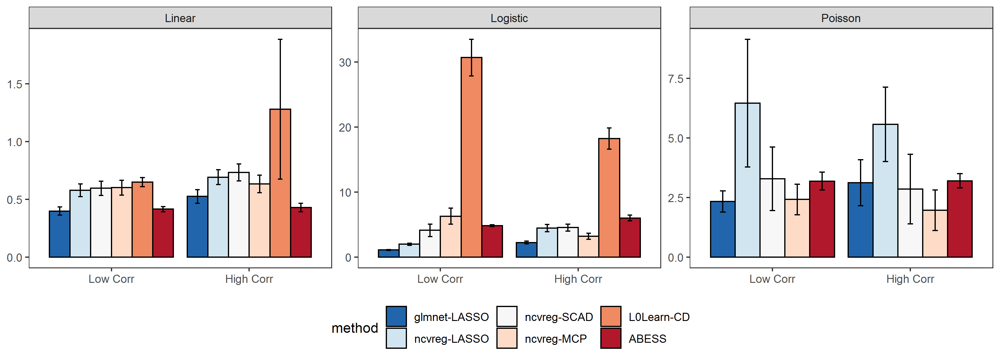

abess: R & Python Software for Best-Subset Selection in Polynomial Time </a>
---

[](https://github.com/abess-team/abess/actions)
[](https://codecov.io/gh/abess-team/abess)
[](https://abess.readthedocs.io/en/latest/?badge=latest)
[](https://cran.r-project.org/package=abess)
[](https://badge.fury.io/py/abess)
[](https://img.shields.io/pypi/pyversions/abess)
[](http://www.gnu.org/licenses/gpl-3.0)
[](https://www.codacy.com/gh/abess-team/abess/dashboard?utm_source=github.com&amp;utm_medium=referral&amp;utm_content=abess-team/abess&amp;utm_campaign=Badge_Grade)
<!-- [](https://travis-ci.com/abess-team/abess) -->

**abess** (Adaptive Best Subset Selection) aims to find a small subset of predictors such
that the resulting linear model is expected to have the most desirable
prediction accuracy. This project implements a polynomial algorithm proposed to solve these problems. It supports:

-  linear regression
-  classification (binary or multi-class)
-  counting-response modeling
-  censored-response modeling
-  multi-response modeling (multi-tasks learning)
-  group best subset selection
-  nuisance penalized regression
-  sure independence screening


## Installation
The abess software has both Python and R's interfaces. 

### Python package
Install the stable version of Python-package from [Pypi](https://pypi.org/project/abess/) with:
```shell
pip install abess
```

### R package
Install the stable version of R-package from [CRAN](https://cran.r-project.org/web/packages/abess) with:
```shell
install.packages("abess")
```

## Performance

To show the computational efficiency of abess, 
we compare abess R package with popular R libraries: glmnet, ncvreg, picasso for linear, logistic and poisson regressions; 
Timings of the CPU execution are recorded in seconds and averaged over 100 replications on a sequence
of 100 regularization parameters.

<!-- We consider three aspects. The first one is the prediction performance on a validation data set of size 1000. For linear and poisson regression, this is measured by $\|X\hat{\beta}-X\beta^*\|_2$ where $\hat{\beta}$ is the fitted coefficients and $\beta^*$ is the true coefficients. For the logistic regression, we use the AUC. The second is the selection performance in terms of true positive rate (TPR) and false positive rate (FPR). The third is the running time. -->

<!-- The designed matrix is formed by i.i.d sample generated from a multivariate normal distribution with mean 0 and covariance matrix $\Sigma = (\sigma_{ij})$. We consider two settings—low correlation and high correlation. For the low correlation scenario, we set $\sigma_{ij} = 0.1^{|i-j|}$ and for the high correlation $\sigma_{ij} = 0.7$. The number of predictors is 1000. The true coefficient $\beta^*$ is a vector with 10 nonzero entries uniformly distributed in $[b,B]$. We set $b=5\sqrt{2\log(p)/n}$, $B = 100b$ for linear regression $b = 10\sqrt{2\log(p)/n}$, $B = 5*b$ for logistic regression and $b = -10 \sqrt{2  \log(p) / n}$, $B=10 \sqrt{2 \log(p) / n}$ for poisson regression. A random noise generated from a standard Gaussian distribution is added to the linear predictor $x^\prime\beta$ for linear regression. The size of training data is 500. -->


```r
source("R-package/example/timing.R")
```

All experiments are
evaluated on an Intel(R) Xeon(R) CPU E5-2620 v4 @ 2.10GHz and under R version 3.6.1. for 100 replicas.
<!-- Results are presented in the following table and figure. For all the scenarios, the L0-based estimators in L0Learn and abess show the best prediction performance with the abess performs better in terms of variable selection and efficiency. For linear regression, we see that the Lasso estimator in both glmnet and ncvreg has the largest prediction error compared with other estimators. With the increase in correlation, difficulties of identifying the sparsity structure increase for MCP (ncvreg) and SCAD (ncvreg). For logistic regression, abess shows a great advantage in efficiency compared with L0Learn. Here we see that it is difficult for L0-based method to identify all the true significant predictors in high correlation setting, but abess is generally the least likely to make a mistake. 
For poisson regression, our abess package continues to exhibit the dominance of over prediction performance and variable selection. 
Notably, as a package aiming at best subset selection, abess shows a competitive short run time, never been eclipsed by comparison with glmnet and ncvreg which are famous for high efficiency. -->

Results are presented in the following picture. As a package solving the best subset selection, abess reaches a high efficient performance especially in linear regression where it gives the fastest solution.


<center> Figure 1. Runing Time for different packages </center>

<!---->
</a>
<!-- <center> Table 1. Results of Linear Rgression </center>

|           |              | Coef Err       | RPE              | TPR          | FPR          | MCC          |
|-----------|--------------|----------------|------------------|--------------|--------------|--------------|
| Low Corr  | glmnet-LASSO | 4.678(0.707)   | 0.031(0.001)     | 0.988(0.033) | 0(0)         | 0.994(0.017) |
|           | ncvreg-LASSO | 12.367(1.33)   | 0.082(0.01)      | 0.965(0.059) | 0(0)         | 0.982(0.031) |
|           | ncvreg-SCAD  | 2.951(1.983)   | 0.022(0.012)     | 0.962(0.063) | 0(0)         | 0.98(0.034)  |
|           | ncvreg-MCP   | 1.981(1.623)   | 0.016(0.009)     | 0.962(0.063) | 0(0)         | 0.98(0.034)  |
|           | L0Learn-CD   | 0.225(0.032)   | 0.007(0.001)     | 1(0)         | 0.001(0.001) | 0.944(0.023) |
|           | ABESS        | 0.156(0.042)   | 0.007(0.001)     | 1(0)         | 0(0)         | 0.995(0.016) |
| High Corr | glmnet-LASSO | 4.447(0.833)   | 0.031(0.001)     | 0.989(0.031) | 0.001(0.002) | 0.936(0.061) |
|           | ncvreg-LASSO | 7.372(1.271)   | 0.052(0.001)     | 0.98(0.047)  | 0.001(0.001) | 0.955(0.052) |
|           | ncvreg-SCAD  | 74.965(18.783) | 0.115(0.018)     | 0.664(0.128) | 0(0)         | 0.81(0.08)   |
|           | ncvreg-MCP   | 58.82(14.013)  | 0.09(0.017)      | 0.577(0.072) | 0(0)         | 0.756(0.048) |
|           | L0Learn-CD   | 0.806(0.373)   | 0.003(0.001)     | 1(0)         | 0.019(0.024) | 0.688(0.188) |
|           | ABESS        | 0.255(0.075)   | 0.003(0.001)     | 1(0)         | 0(0)         | 0.996(0.013) |


<center> Table 2. Results of Logistic Regression </center>


|           |              | Coef Err       | AUC              | TPR          | FPR          | MCC          |
|-----------|--------------|----------------|------------------|--------------|--------------|--------------|
| Low Corr  | glmnet-LASSO | 12.566(1.902)  | 0.98(0.006)      | 0.999(0.01)  | 0.119(0.017) | 0.264(0.021) |
|           | ncvreg-LASSO | 13.228(1.775)  | 0.983(0.005)     | 0.999(0.01)  | 0.095(0.01)  | 0.296(0.017) |
|           | ncvreg-SCAD  | 3.948(2.504)   | 0.994(0.003)     | 0.999(0.01)  | 0.006(0.005) | 0.803(0.117) |
|           | ncvreg-MCP   | 3.773(2.02)    | 0.994(0.002)     | 0.995(0.022) | 0.001(0.002) | 0.951(0.061) |
|           | L0Learn-CD   | 2.636(1.402)   | 0.995(0.003)     | 0.983(0.04)  | 0(0)         | 0.987(0.024) |
|           | ABESS        | 5.842(7.22)    | 0.994(0.003)     | 0.98(0.045)  | 0(0)         | 0.989(0.024) |
| High Corr | glmnet-LASSO | 14.822(1.976)  | 0.993(0.003)     | 0.792(0.114) | 0.044(0.008) | 0.339(0.063) |
|           | ncvreg-LASSO | 15.907(1.892)  | 0.992(0.003)     | 0.742(0.13)  | 0.038(0.008) | 0.342(0.074) |
|           | ncvreg-SCAD  | 15.895(1.903)  | 0.992(0.003)     | 0.742(0.13)  | 0.038(0.008) | 0.343(0.075) |
|           | ncvreg-MCP   | 15.303(1.964)  | 0.992(0.004)     | 0.663(0.143) | 0.014(0.004) | 0.46(0.109)  |
|           | L0Learn-CD   | 14.277(2.969)  | 0.98(0.011)      | 0.295(0.148) | 0.003(0.002) | 0.375(0.172) |
|           | ABESS        | 13.733(2.649)  | 0.978(0.013)     | 0.321(0.142) | 0.002(0.006) | 0.473(0.176) |


<center> Table 3. Results of Poisson Regression </center>

|           |              | Coef Err       | RPE              | TPR          | FPR          | MCC          |
|-----------|--------------|----------------|------------------|--------------|--------------|--------------|
| Low Corr  | glmnet-LASSO | 1.353(1.081)   | 10.548(36.648)   | 0.928(0.102) | 0.045(0.016) | 0.397(0.045) |
|           | ncvreg-LASSO | 2.929(1.793)   | 12.255(37.967)   | 0.717(0.231) | 0.024(0.008) | 0.396(0.096) |
|           | ncvreg-SCAD  | 1.376(1.371)   | 11.338(37.8)     | 0.733(0.228) | 0.002(0.003) | 0.754(0.214) |
|           | ncvreg-MCP   | 1.298(1.198)   | 12.283(38.226)   | 0.668(0.234) | 0.001(0.001) | 0.736(0.211) |
|           | ABESS        | 0.918(2.503)   | 97.004(760.852)  | 0.894(0.216) | 0.012(0.019) | 0.735(0.27)  |
| High Corr | glmnet-LASSO | 1.551(1.556)   | 139.184(776.926) | 0.782(0.237) | 0.037(0.02)  | 0.372(0.104) |
|           | ncvreg-LASSO | 3.255(2.655)   | 148.255(785.144) | 0.491(0.367) | 0.014(0.011) | 0.324(0.217) |
|           | ncvreg-SCAD  | 2.09(2.621)    | 162.707(808.582) | 0.523(0.38)  | 0.002(0.002) | 0.566(0.386) |
|           | ncvreg-MCP   | 1.745(1.988)   | 143.399(798.914) | 0.538(0.369) | 0.001(0.002) | 0.592(0.375) |
|           | ABESS        | 0.212(0.283)   | 48.972(414.901)  | 0.923(0.101) | 0.011(0.018) | 0.784(0.217) | -->


## Reference
A polynomial algorithm for best-subset selection problem. Junxian Zhu, Canhong Wen, Jin Zhu, Heping Zhang, Xueqin Wang. Proceedings of the National Academy of Sciences Dec 2020, 117 (52) 33117-33123; DOI: 10.1073/pnas.2014241117           
Fan, J. and Lv, J. (2008), Sure independence screening for ultrahigh dimensional feature space. Journal of the Royal Statistical Society: Series B (Statistical Methodology), 70: 849-911. https://doi.org/10.1111/j.1467-9868.2008.00674.x         
Qiang Sun & Heping Zhang (2020) Targeted Inference Involving High-Dimensional Data Using Nuisance Penalized Regression, Journal of the American Statistical Association, DOI: 10.1080/01621459.2020.1737079     
Zhang, Y., Zhu, J., Zhu, J. and Wang, X., 2021. Certifiably Polynomial Algorithm for Best Group Subset Selection. arXiv preprint arXiv:2104.12576.
