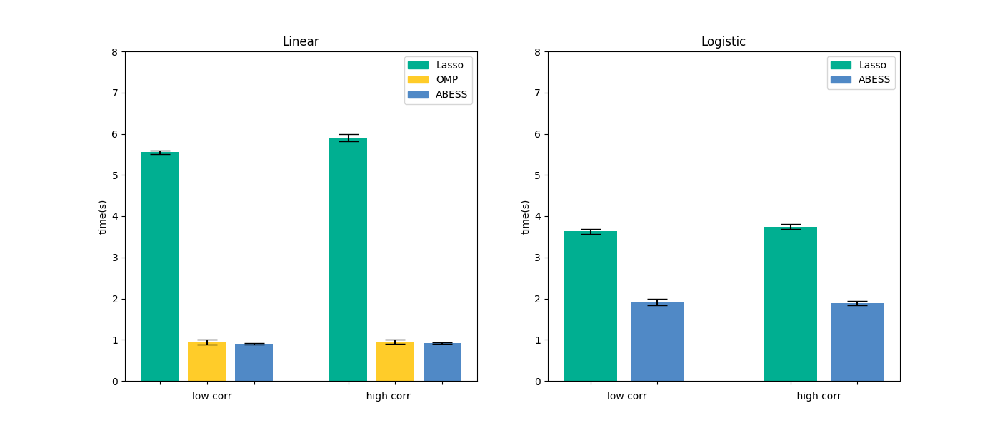
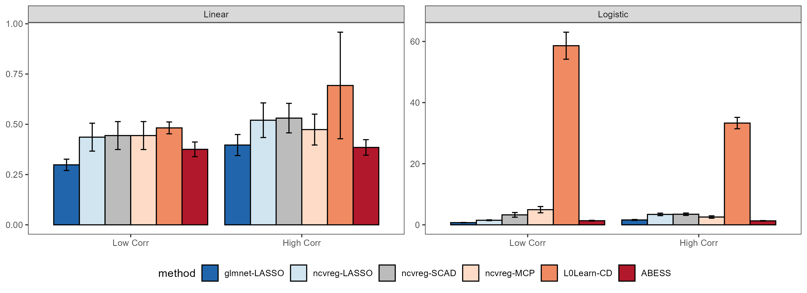

</a>     

# abess: Fast Best-Subset Selection in Python and R

[](https://github.com/abess-team/abess/actions/workflows/python_test.yml)
[](https://github.com/abess-team/abess/actions/workflows/r_test.yml)
[](https://codecov.io/gh/abess-team/abess)
[](https://abess.readthedocs.io/en/latest/?badge=latest)
[](https://abess-team.github.io/abess/)
[](https://cran.r-project.org/package=abess)
[](https://badge.fury.io/py/abess)
[](https://img.shields.io/pypi/pyversions/abess)
[](http://www.gnu.org/licenses/gpl-3.0)
[](https://www.codacy.com/gh/abess-team/abess/dashboard?utm_source=github.com&amp;utm_medium=referral&amp;utm_content=abess-team/abess&amp;utm_campaign=Badge_Grade)
[](https://www.codefactor.io/repository/github/abess-team/abess)
<!-- [](https://travis-ci.com/abess-team/abess) -->

## Overview
`abess` (Adaptive BEst Subset Selection) library aims to solve general best subset selection, i.e., 
find a small subset of predictors such that the resulting model is expected to have the highest accuracy. 
The selection for best subset shows great value in scientific researches and practical applications. 
For example, clinicians want to know whether a patient is healthy or not based on the expression levels of a few of important genes.

This library implements a generic algorithm framework to find the optimal solution in an extremely fast way.
This framework now supports the detection of best subset under: 
[linear regression](https://abess.readthedocs.io/en/latest/Tutorial/LinearRegression.html),
[classification (binary or multi-class)](https://abess.readthedocs.io/en/latest/Tutorial/logi_and_multiclass.html),
[counting-response modeling](https://abess.readthedocs.io/en/latest/Tutorial/PoissonRegression.html),
[censored-response modeling](https://abess.readthedocs.io/en/latest/Tutorial/CoxRegression.html),
[multi-response modeling (multi-tasks learning)](https://abess.readthedocs.io/en/latest/Tutorial/MultiTaskLearning.html), etc.
It also supports the variants of best subset selection like 
[group best subset selection](https://abess.readthedocs.io/en/latest/Tutorial/advanced_features.html#Best-group-subset-selection),
[nuisance penalized regression](https://abess.readthedocs.io/en/latest/Tutorial/advanced_features.html#Nuisance-Regression),
Especially, the time complexity of (group) best subset selection for linear regression is certifiably polynomial.

## Quick start

The `abess` software has both Python and R's interfaces. Here a quick start will be given and for more details, please view: [Installation](https://abess.readthedocs.io/en/latest/Installation.html).

### Python package

Install the stable version of Python-package from [Pypi](https://pypi.org/project/abess/) with:

```shell
$ pip install abess
```

Best subset selection for linear regression on a simulated dataset in Python:    

```python
from abess.linear import LinearRegression
from abess.datasets import make_glm_data
sim_dat = make_glm_data(n = 300, p = 1000, k = 10, family = "gaussian")
model = LinearRegression()
model.fit(sim_dat.x, sim_dat.y)
```


See more examples analyzed with Python in the [Python tutorials](https://abess.readthedocs.io/en/latest/Tutorial/index.html).


### R package

Install the stable version of R-package from [CRAN](https://cran.r-project.org/web/packages/abess) with:

```r
install.packages("abess")
```

Best subset selection for linear regression on a simulated dataset in R:

```r
library(abess)
sim_dat <- generate.data(n = 300, p = 1000)
abess(x = sim_dat[["x"]], y = sim_dat[["y"]])
```

See more examples analyzed with R in the [R tutorials](https://abess-team.github.io/abess/articles/).


## Runtime Performance

To show the power of abess in computation, we assess its timings of the CPU execution (seconds) on synthetic datasets, and compare to state-of-the-art variable selection methods. The variable selection and estimation results are deferred to [Python performance](https://abess.readthedocs.io/en/latest/Tutorial/power_of_abess.html) and [R performance](https://abess-team.github.io/abess/articles/v11-power-of-abess.html). All computations are conducted on a Ubuntu platform with Intel(R) Core(TM) i9-9940X CPU @ 3.30GHz and 48 RAM.

### Python package   

We compare `abess` Python package with `scikit-learn` on linear regression and logistic regression. Results are presented in the below figure:



It can be see that `abess` uses the least runtime to find the solution. This results can be reproduced by running the command in shell:

```shell
$ python abess/docs/simulation/Python/timings.py
```


### R package

We compare `abess` R package with three widely used R packages: `glmnet`, `ncvreg`, and `L0Learn`. 
We get the runtime comparison results:



Compared with other packages, 
`abess` shows competitive computational efficiency, 
and achieves the best computational power when variables have a large correlation.

Conducting the following command in shell can reproduce the above results in R: 

```shell
$ Rscript abess/docs/simulation/R/timings.R
```

## Open source software     

`abess` is a free software and its source code is publicly available on [Github](https://github.com/abess-team/abess). The core framework is programmed in C++, and user-friendly R and Python interfaces are offered. You can redistribute it and/or modify it under the terms of the [GPL-v3 License](https://www.gnu.org/licenses/gpl-3.0.html). We welcome contributions for `abess`, especially stretching `abess` to the other best subset selection problems. 

## What's news

New features:

- Support user-specified cross validation division.
- Support user-specified initial active set.
- Support flexible support size for sequentially best subset selection for principal component analysis (PCA). 

New best subset selection tasks: 

- Generalized linear model when the link function is gamma distribution.
- Robust principal component analysis (RPCA).

## Citation         

If you use `abess` or reference our tutorials in a presentation or publication, we would appreciate citations of our library.
> Jin Zhu, Liyuan Hu, Junhao Huang, Kangkang Jiang, Yanhang Zhang, Shiyun Lin, Junxian Zhu, Xueqin Wang (2021). “abess: A Fast Best Subset Selection Library in Python and R.” arXiv:2110.09697.

The corresponding BibteX entry:

```
@article{zhu-abess-arxiv,
  author    = {Jin Zhu and Liyuan Hu and Junhao Huang and Kangkang Jiang and Yanhang Zhang and Shiyun Lin and Junxian Zhu and Xueqin Wang},
  title     = {abess: A Fast Best Subset Selection Library in Python and R},
  journal   = {arXiv:2110.09697},
  year      = {2021},
}
```

## References

- Junxian Zhu, Canhong Wen, Jin Zhu, Heping Zhang, and Xueqin Wang (2020). A polynomial algorithm for best-subset selection problem. Proceedings of the National Academy of Sciences, 117(52):33117-33123.

- Pölsterl, S (2020). scikit-survival: A Library for Time-to-Event Analysis Built on Top of scikit-learn. J. Mach. Learn. Res., 21(212), 1-6.

- Yanhang Zhang, Junxian Zhu, Jin Zhu, and Xueqin Wang (2021). Certifiably Polynomial Algorithm for Best Group Subset Selection. arXiv preprint arXiv:2104.12576.

- Qiang Sun and Heping Zhang (2020). Targeted Inference Involving High-Dimensional Data Using Nuisance Penalized Regression, Journal of the American Statistical Association, DOI: 10.1080/01621459.2020.1737079.

- Jin Zhu, Liyuan Hu, Junhao Huang, Kangkang Jiang, Yanhang Zhang, Shiyun Lin, Junxian Zhu, and Xueqin Wang (2021). abess: A Fast Best Subset Selection Library in Python and R. arXiv:2110.09697, 2021.
