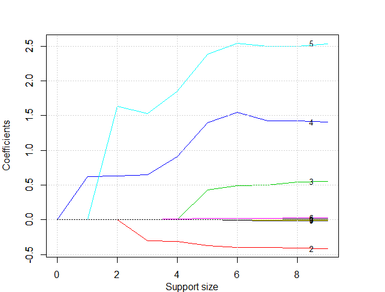
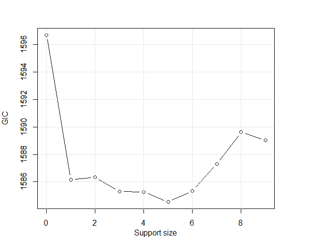

================
Cox Regression
================

Lung Cancer Dataset
--------------------

We are going to apply best subset selection to the NCCTG Lung Cancer Dataset in the `survival` package. This dataset consists of survival informatoin of patients with advanced lung cancer from the North Central Cancer Treatment Group. The proportional hazards model allows the analysis of survival data by regression modeling.
Linearity is assumed on the log scale of the hazard. The hazard ratio in Cox proportional hazard model
 is assumed constant. First, we load the data. 
.. code-block:: r

    > data(lung, package = 'survival')
    > head(lung)
    inst time status age sex ph.ecog ph.karno pat.karno meal.cal wt.loss
    1    3  306      2  74   1       1       90       100     1175      NA
    2    3  455      2  68   1       0       90        90     1225      15
    3    3 1010      1  56   1       0       90        90       NA      15
    4    5  210      2  57   1       1       90        60     1150      11
    5    1  883      2  60   1       0      100        90       NA       0
    6   12 1022      1  74   1       1       50        80      513       0
    > sum(is.na(lung))
    [1] 67

Then we remove the rows containing any missing data. After that, we have a total of 167 observations. 
.. code-block:: r

    > lung <- na.omit(lung)
    > lung <- lung[, -1]
    > dim(lung)
    [1] 167  10

Then we change the factors into dummy variables with the `model.matrix()` function. Note that the `abess` function will automatically include the intercept.

.. code-block:: r

    > lung$ph.ecog <- as.factor(lung$ph.ecog)
    > lung <- model.matrix(~., lung)[, -1]

We split the dataset into a training set and a test set. The model is going to be built on the training set and later We will test the model performance on the test set.
.. code-block:: r

    > train <- lung[1:round((167*2)/3), ]
    > test <- lung[-(1:round((167*2)/3)), ]

Best Subset Selection for CoxPH Regression
--------------------------------------------
The `abess()` function in the `abess` package allows you to perform best subset selection in a highly efficient way. For CoxPH model, the survival information should be passed to `y` as a matrix with the first column storing the observed time and the second the status. The covariates should be passed to `x`.
.. code-block:: r

    > library(abess)
    > abess_fit <- abess(x = train[, -(1:2)], y = train[, 1:2], family = "cox")

By default, the `abess` function implements the ABESS algorithm with the support size changing from 0 to $\min\{p,n/log(n)p \}$ and the best support size is determined by the Generalized Informatoin Criterion (GIC). You can change the tunging criterion by specifying the argument `tune.type`. The available tuning criterion now are `gic`, `aic`, `bic`, `ebic` and `cv`. Here we give an example.

.. code-block:: r

    > abess_fit.gs <- abess(x = train[, -(1:2)], y = train[, 1:2], family = "cox", tune.type = "bic")

Interprate the Result
----------------------

Hold on, we aren't finished yet. After get the estimator, we can further do more exploring work.
The output of `abess()` function contains the best model for all the candidate support size in the `support.size`. You can use some generic function to quickly draw some information of those estimators.

.. code-block:: r
    > # draw the estimated coefficients on all candidate support size
    > coef(abess_fit)
    10 x 10 sparse Matrix of class "dgCMatrix"
    [[ suppressing 10 column names ‘0’, ‘1’, ‘2’ ... ]]
                                                                                                
    (intercept) . .         .          .          .           .           .            .          
    age         . .         .          .          .           .           .            .          
    sex         . .         .         -0.3056507 -0.31215218 -0.37216950 -0.397995667 -0.400493303
    ph.ecog1    . .         .          .          .           0.43313467  0.491343307  0.499949884
    ph.ecog2    . 0.6198472 0.6340005  0.6485150  0.90762605  1.39709205  1.545513274  1.424131920
    ph.ecog3    . .         1.6332116  1.5289436  1.85001625  2.38778405  2.543614482  2.499382520
    ph.karno    . .         .          .          0.01230716  0.02222591  0.022680364  0.024310342
    pat.karno   . .         .          .          .           .           .           -0.008446641
    meal.cal    . .         .          .          .           .           .            .          
    wt.loss     . .         .          .          .           .          -0.008627062 -0.010143182
                                        
    (intercept)  .            .           
    age          0.009608071  0.0087628223
    sex         -0.404941177 -0.4176181736
    ph.ecog1     0.544370477  0.5487752876
    ph.ecog2     1.425800199  1.4055828478
    ph.ecog3     2.498480073  2.5322886865
    ph.karno     0.026438213  0.0266007344
    pat.karno   -0.008262139 -0.0076751166
    meal.cal     .           -0.0001728142
    wt.loss     -0.009555062 -0.0097601250
    > 
    > # get the deviance of the estimated model on all candidate support size
    > deviance(abess_fit)
    [1] 798.3509 791.3829 789.7577 787.5387 785.8258 783.7560 782.4605 781.7364 781.1942 780.8985
    > 
    > # print the fitted model
    > print(abess_fit)
    Call:
    abess.default(x = train[, -(1:2)], y = train[, 1:2], family = "cox")

    support.size      dev      GIC
    1             0 798.3509 1596.702
    2             1 791.3829 1586.171
    3             2 789.7577 1586.325
    4             3 787.5387 1585.292
    5             4 785.8258 1585.271
    6             5 783.7560 1584.536
    7             6 782.4605 1585.350
    8             7 781.7364 1587.306
    9             8 781.1942 1589.627
    10            9 780.8985 1589.035

The `plot.abess()` function helps to visualize the change of models with the change of support size. There are 5 types of graph you can generate, including `coef` for the coefficeint value, `l2norm` for the L2-norm of the coefficients, `dev` for the deviance and `tune` for the tuning value. Default if `coef`.

.. code-block:: r

    > plot(abess_fit, label=T)

.. code-block:: r

    > plot(abess_fit, type="tune")
    

The tuning value reaches the lowest point at 5. And We might choose the estimated model with support size equals 5 as our final model. 

To extract any model from the `abess` object, we can call the `extract()` function with a given `support.size`. If `support.size` is not provided, the model with the best tuning value will be returned. Here we extract the model with support size equals 6.

.. code-block:: r

    > best.model = extract(abess_fit, support.size = 5)
    > str(best.model)
    List of 7
    $ beta        :Formal class 'dgCMatrix' [package "Matrix"] with 6 slots
    .. ..@ i       : int [1:5] 1 2 3 4 5
    .. ..@ p       : int [1:2] 0 5
    .. ..@ Dim     : int [1:2] 9 1
    .. ..@ Dimnames:List of 2
    .. .. ..$ : chr [1:9] "age" "sex" "ph.ecog1" "ph.ecog2" ...
    .. .. ..$ : chr "5"
    .. ..@ x       : num [1:5] -0.3722 0.4331 1.3971 2.3878 0.0222
    .. ..@ factors : list()
    $ intercept   : num 0
    $ support.size: num 5
    $ support.vars: chr [1:5] "sex" "ph.ecog1" "ph.ecog2" "ph.ecog3" ...
    $ support.beta: num [1:5] -0.3722 0.4331 1.3971 2.3878 0.0222
    $ dev         : num 784
    $ tune.value  : num 1585

The return is a list containing the basic information of the estimated model.

Make a Prediction
------------------

Prediction is allowed for all the estimated model. Just call `predict.abess()` function with the `support.size` set to the size of model you are interested in. If a `support.size` is not provided, prediction will be made on the model with best tuning value. The `predict.abess()` can provide both `link`, stands for the linear predictors, and the `response`, stands for the fitted relative-risk. Here We will predict the probablity of survival on the `test.csv` data.

.. code-block:: r

    > fitted.results <- predict(abess_fit, newx = test, type = 'response')

We now calulate the C-index, i.e., the probability that, for a pair of randomly chosen comparable samples, the sample with the higher risk prediction will experience an event before the other sample or belongs to a higher binary class. On this dataset, the C-index is 0.64.

.. code-block:: r

    > library(Hmisc)
    > Cindex <- max(1-rcorr.cens(fitted.results, Surv(test[, 1], test[,2]))[1],rcorr.cens(fitted.results, Surv(test[, 1], test[,2]))[1])
    > Cindex
    [1] 0.6422652