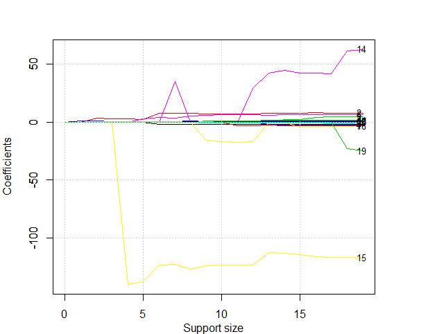
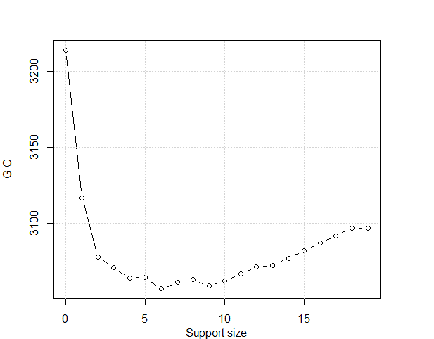

================
Linear Regression
================

In this tutorial, we are going to demonstrate how to use the `abess` package to carry out best subset selection on the `Hitters` dataset. 
We hope to use sevral predictors related to the performance of the baseball atheltes last year to predict their salary.

Hitters Dataset
------------------

First, let's have a look at this dataset. There are 19 variables except `Salary` and 322 observations.

.. code-block:: r

    > data("Hitters", package = 'ISLR')
    > head(Hitters)
                  AtBat Hits HmRun Runs RBI Walks Years CAtBat CHits CHmRun CRuns CRBI CWalks League
    -Andy Allanson      293   66     1   30  29    14     1    293    66      1    30   29     14      A
    -Alan Ashby         315   81     7   24  38    39    14   3449   835     69   321  414    375      N
    -Alvin Davis        479  130    18   66  72    76     3   1624   457     63   224  266    263      A
    -Andre Dawson       496  141    20   65  78    37    11   5628  1575    225   828  838    354      N
    -Andres Galarraga   321   87    10   39  42    30     2    396   101     12    48   46     33      N
    -Alfredo Griffin    594  169     4   74  51    35    11   4408  1133     19   501  336    194      A
                  Division PutOuts Assists Errors Salary NewLeague
    -Andy Allanson           E     446      33     20     NA         A
    -Alan Ashby              W     632      43     10  475.0         N
    -Alvin Davis             W     880      82     14  480.0         A
    -Andre Dawson            E     200      11      3  500.0         N
    -Andres Galarraga        E     805      40      4   91.5         N
    -Alfredo Griffin         W     282     421     25  750.0         A
    > dim(Hitters)
    [1] 322  20
    > sum(is.na(Hitters))
    [1] 59

Note that this dataset contains some missing data. So we use the `na.omit()` function to delete rows that have incomplete information. After that, we have 263 observations remains.

.. code-block:: r

    > Hitters = na.omit(Hitters)
    > dim(Hitters)
    [1] 263  20
    > sum(is.na(Hitters))
    [1] 0

Then we change the factors into dummy variables with the `model.matrix()` function. Note that the `abess` function will automatically include the intercept.

.. code-block:: r

    > Hitters <- model.matrix(~., Hitters)[, -1]
    > Hitters <- as.data.frame(Hitters)

Best Subset Selection for Linear Regression
-----------------------

The `abess()` function in the `abess` package allows you to perform best subset selection in a highly efficient way. You can call the `abess()` funtion using formula just like what you do with `lm()`. Or you can specify the design matrix `x` and the response `y`. 

.. code-block:: r

    > library(abess)
    > abess_fit <- abess(Salary~., Hitters)
    > abess_fit <- abess(Hitters[, -which(colnames(Hitters) == "Salary")], Hitters$Salary)
    > class(abess_fit)
    [1] "abess"

By default, the `abess` function implements the ABESS algorithm with the support size changing from 0 to $\min\{p,n/log(n)p \}$ and the best support size is determined by the Generalized Informatoin Criterion (GIC). You can change the tunging criterion by specifying the argument `tune.type`. The available tuning criterion now are `gic`, `aic`, `bic`, `ebic` and `cv`. For a quicker solution, you can change the tuning strategy to a golden section path which trys to find the elbow point of the tuning criterion over the hyperparameter space. Here we give an example.

.. code-block:: r

    > abess_fit.gs <- abess(Salary~., Hitters, tune = "bic", tune.path = "gs")

Interprate the Result
----------------------

Hold on, we aren't finished yet. After get the estimator, we can further do more exploring work.
The output of `abess()` function contains the best model for all the candidate support size in the `support.size`. You can use some generic function to quickly draw some information of those estimators.

.. code-block:: r

    > # draw the estimated coefficients on all candidate support size
    > coef(abess_fit)
    20 x 20 sparse Matrix of class "dgCMatrix"
       [[ suppressing 20 column names ‘0’, ‘1’, ‘2’ ... ]]
                                                                                               
    (intercept) 535.9259 274.5803864 -47.9559022 -71.4592204   13.9231044   -7.6563819   91.5117981
    AtBat         .        .           .           .            .            .           -1.8685892
    Hits          .        .           3.3008446   2.8038162    2.6757978    2.0467293    7.6043976
    HmRun         .        .           .           .            .            .            .        
    Runs          .        .           .           .            .            .            .        
    RBI           .        .           .           .            .            .            .        
    Walks         .        .           .           .            .            2.5574106    3.6976468
    Years         .        .           .           .            .            .            .        
    CAtBat        .        .           .           .            .            .            .        
    CHits         .        .           .           .            .            .            .        
    CHmRun        .        .           .           .            .            .            .        
    CRuns         .        .           .           .            .            .            .        
    CRBI          .        0.7909536   0.6898994   0.6825275    0.6817790    0.6492007    0.6430169
    CWalks        .        .           .           .            .            .            .        
    LeagueN       .        .           .           .            .            .            .        
    DivisionW     .        .           .           .         -139.9538855 -137.3676333 -122.9515338
    PutOuts       .        .           .           0.2735814    0.2735002    0.2518721    0.2643076
    Assists       .        .           .           .            .            .            .        
    Errors        .        .           .           .            .            .            .        
    NewLeagueN    .        .           .           .            .            .            .        
                                                                                                      
    (intercept)   67.9431538  114.5067227  197.6616396  206.5672285  218.5527334  198.4967427  142.9090129
    AtBat         -1.8535176   -2.1250564   -2.0803280   -2.2556858   -2.2102483   -2.1783358   -2.0120568
    Hits           7.6348879    7.6482495    6.8263359    7.0378766    6.9279436    6.9273744    7.3751935
    HmRun          .            .            .            .            .            .            .        
    Runs           .            .            .            .            .            .           -1.7130320
    RBI            .            .            .            .            .            .            .        
    Walks          3.6644212    5.2391412    5.9761215    6.2793246    6.2243570    6.1667822    5.9906173
    Years          .            .          -15.9414459  -16.7414858  -17.2542087  -17.0664017    .        
    CAtBat         .            .            .            .            .            .           -0.1527096
    CHits          .            .            .            .            .            .            .        
    CHmRun         .            .            .            .            .            .            .        
    CRuns          .            .            0.8143029    0.8132079    0.8111144    0.8082476    1.5535444
    CRBI           0.6445474    0.8959228    0.6000624    0.6508515    0.6594949    0.6571221    0.7850103
    CWalks         .           -0.3487728   -0.7503761   -0.7882990   -0.7934064   -0.7898841   -0.8404419
    LeagueN       35.0926551    .            .            .            .           29.1474123   41.9165343
    DivisionW   -122.5437635 -126.8503150 -123.4936780 -123.2261893 -123.1231837 -122.8009102 -112.3809790
    PutOuts        0.2584749    0.2655057    0.2702288    0.2824819    0.2883338    0.2830813    0.2896964
    Assists        .            0.1790809    .            0.1872292    0.2795390    0.2732454    0.3312276
    Errors         .            .            .            .           -3.0198567   -3.3107203   -2.8685826
    NewLeagueN     .            .            .            .            .            .            .        
                                                                                            
    (intercept)  144.6793182  163.3275824  163.0064063  162.9932027  163.1632541  163.1035878
    AtBat         -2.0883279   -2.1085651   -2.0890552   -2.0302709   -2.0186239   -1.9798729
    Hits           7.6436454    7.6501026    7.8848050    7.7483580    7.7381465    7.5007675
    HmRun          2.3406524    2.3654025    3.8223369    4.6470956    4.6127592    4.3308829
    Runs          -2.3580478   -2.3535049   -2.5377954   -2.5882384   -2.6272166   -2.3762100
    RBI            .            .           -0.8815425   -1.1165187   -1.1190038   -1.0449620
    Walks          6.1794713    6.1730276    6.2941910    6.2778803    6.3108843    6.2312863
    Years          .           -4.2321550   -4.0947594   -3.7490950   -3.8738277   -3.4890543
    CAtBat        -0.1488074   -0.1341737   -0.1350897   -0.1526121   -0.1514014   -0.1713405
    CHits          .            .            .            .            .            0.1339910
    CHmRun         .            .            .           -0.3876922   -0.3938397   -0.1728611
    CRuns          1.5931621    1.5426322    1.5321626    1.5730263    1.5708067    1.4543049
    CRBI           0.7170767    0.7144063    0.7420886    0.8965235    0.8961782    0.8077088
    CWalks        -0.8565844   -0.8446970   -0.8559654   -0.8423839   -0.8467366   -0.8115709
    LeagueN       44.2352269   42.2835360   42.2286763   41.6482699   61.3012822   62.5994230
    DivisionW   -112.8079905 -113.9853363 -116.0422926 -116.4111439 -116.5862127 -116.8492456
    PutOuts        0.2876182    0.2859836    0.2858651    0.2827595    0.2829156    0.2818925
    Assists        0.3677311    0.3643305    0.3641325    0.3661464    0.3640952    0.3710692
    Errors        -3.1271251   -3.2379385   -3.1409199   -3.1840695   -3.2558249   -3.3607605
    NewLeagueN     .            .            .            .          -22.9788245  -24.7623251
    > 
    > # get the deviance of the estimated model on all candidate support size
    > deviance(abess_fit)
    [1] 202734.27 137565.32 116526.84 111214.06 106353.05 104483.91  99600.40  99303.92  98158.60  94654.62
    [11]  94081.77  93894.74  93695.85  92354.17  92200.23  92154.67  92106.59  92065.27  92032.81  92017.87
    > 
    > # print the fitted model
    > print(abess_fit)
    Call:
    abess.default(x = Hitters[, -which(colnames(Hitters) == "Salary")], 
        y = Hitters$Salary)

    support.size       dev      GIC
    1             0 202734.27 3213.768
    2             1 137565.32 3116.836
    3             2 116526.84 3078.241
    4             3 111214.06 3071.026
    5             4 106353.05 3064.330
    6             5 104483.91 3064.725
    7             6  99600.40 3057.194
    8             7  99303.92 3061.468
    9             8  98158.60 3063.475
    10            9  94654.62 3058.972
    11           10  94081.77 3062.434
    12           11  93894.74 3066.968
    13           12  93695.85 3071.469
    14           13  92354.17 3072.733
    15           14  92200.23 3077.352
    16           15  92154.67 3082.280
    17           16  92106.59 3087.201
    18           17  92065.27 3092.141
    19           18  92032.81 3097.106
    20           19  92017.87 3097.063

Prediction is allowed for all the estimated model. Just call `predict.abess()` function with the `support.size` set to the size of model you are interested in. If a `support.size` is not provided, prediction will be made on the model with best tuning value.

.. code-block:: r

    > predict(abess_fit, newx = Hitters[, -which(colnames(Hitters)=="Salary")], 
        support.size = c(3, 4))

The `plot.abess()` function helps to visualize the change of models with the change of support size. There are 5 types of graph you can generate, including `coef` for the coefficeint value, `l2norm` for the L2-norm of the coefficients, `dev` for the deviance and `tune` for the tuning value. Default if `coef`.

.. code-block:: r

    > plot(abess_fit, label=T)
    

The graph shows that, begining from the most dense model, the 15th variable (Division, A factor with levels E and W indicating player's division at the end of 1986) is included in the active set until the support size reaches 3.

We can also generate a graph about the tuning value. Remember that we used the default GIC to tune the support size. 

.. code-block:: r

    > plot(abess_fit, type="tune")

The tuning value reaches the lowest point at 6. And We might choose the estimated model with support size equals 6 as our final model. 
In fact, the tuning values of different model sizes are provided in `tune.value` of the `abess` object. You can get the best model size through the following call.

.. code-block:: r

    > abess_fit$support.size[which.min(abess_fit$tune.value)]
    [1] 6

To extract any model from the `abess` object, we can call the `extract()` function with a given `support.size`. If `support.size` is not provided, the model with the best tuning value will be returned. Here we extract the model with support size equals 6.

.. code-block:: r

    > best.model = extract(abess_fit, support.size = 6)
    > str(best.model)
    List of 7
    $ beta        :Formal class 'dgCMatrix' [package "Matrix"] with 6 slots
    .. ..@ i       : int [1:6] 0 1 5 11 14 15
    .. ..@ p       : int [1:2] 0 6
    .. ..@ Dim     : int [1:2] 19 1
    .. ..@ Dimnames:List of 2
    .. .. ..$ : chr [1:19] "AtBat" "Hits" "HmRun" "Runs" ...
    .. .. ..$ : chr "6"
    .. ..@ x       : num [1:6] -1.869 7.604 3.698 0.643 -122.952 ...
    .. ..@ factors : list()
    $ intercept   : num 91.5
    $ support.size: num 6
    $ support.vars: chr [1:6] "AtBat" "Hits" "Walks" "CRBI" ...
    $ support.beta: num [1:6] -1.869 7.604 3.698 0.643 -122.952 ...
    $ dev         : num 99600
    $ tune.value  : num 3057

The return is a list containing the basic information of the estimated model.