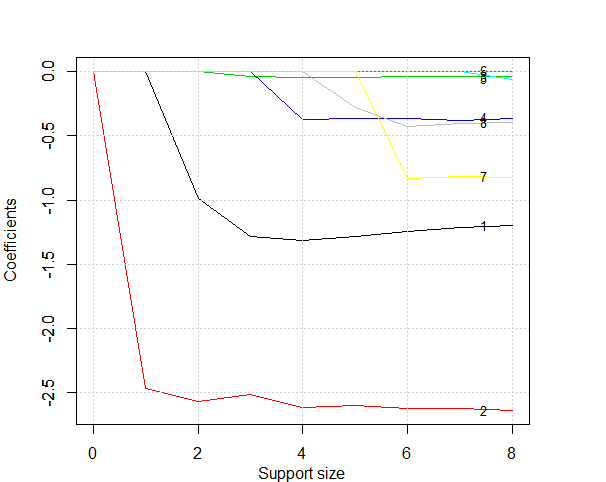
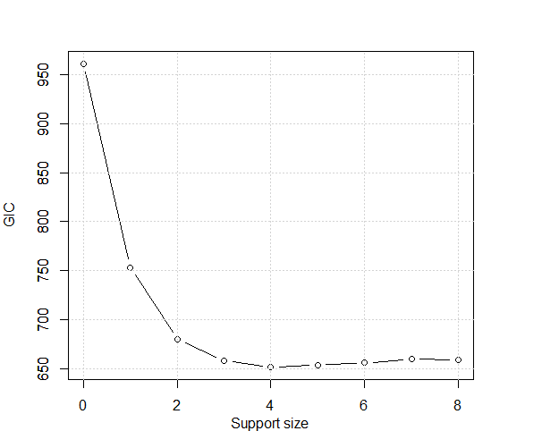

==================
Logistic Regression
==================

Smarket Dataset
------------------

We are going to apply best subset selection to the Titanic dataset obtained here https://www.kaggle.com/c/titanic/data. The training dataset consists of data about 889 passengers, and the goal of the competition is to predict the survival based on features including the class of service, the sex, the age etc. First, let's have a look at the dataset and exam if there is any missing data.

.. code-block:: r

    > train <- read.csv('train.csv', header = T, na.strings=c(""))
    > head(train)
    PassengerId Survived Pclass                                                Name    Sex Age SibSp Parch           Ticket    Fare Cabin Embarked
    1           1        0      3                             Braund, Mr. Owen Harris   male  22     1     0        A/5 21171  7.2500  <NA>        S
    2           2        1      1 Cumings, Mrs. John Bradley (Florence Briggs Thayer) female  38     1     0         PC 17599 71.2833   C85        C
    3           3        1      3                              Heikkinen, Miss. Laina female  26     0     0 STON/O2. 3101282  7.9250  <NA>        S
    4           4        1      1        Futrelle, Mrs. Jacques Heath (Lily May Peel) female  35     1     0           113803 53.1000  C123        S
    5           5        0      3                            Allen, Mr. William Henry   male  35     0     0           373450  8.0500  <NA>        S
    6           6        0      3                                    Moran, Mr. James   male  NA     0     0           330877  8.4583  <NA>        Q
    > train <- train[, c(2,3,5,6,7,8,10,12)]
    > sum(is.na(train))
    [1] 179

The `na.omit()` function allows us to delete the rows that contain any missing data. After that, we get a total of 714 samples left. 
.. code-block:: r

    > train <- na.omit(train)
    > dim(train)
    [1] 712   8

Best Subset Selection for Logistic Regression
----------------------------------------------

The `abess()` function in the `abess` package allows you to perform best subset selection in a highly efficient way. You can call the `abess()` funtion using formula just like what you do with `lm()`. Or you can specify the design matrix `x` and the response `y`.

.. code-block:: r

    > library(abess)
    > abess_fit <- abess(Survived~., data = train, family = "binomial")
    > abess_fit <- abess(x = train[, -1], y = train$Survived, family = "binomial")

By default, the `abess` function implements the ABESS algorithm with the support size changing from 0 to $\min\{p,n/log(n)p \}$ and the best support size is determined by the Generalized Informatoin Criterion (GIC). You can change the tunging criterion by specifying the argument `tune.type`. The available tuning criterion now are `gic`, `aic`, `bic`, `ebic` and `cv`. For a quicker solution, you can change the tuning strategy to a golden section path which trys to find the elbow point of the tuning criterion over the hyperparameter space. Here we give an example.

.. code-block:: r

    abess_fit.gs <- abess(Survived~., data = train, family = "binomial", tune = "bic", tune.path = "gs")

Interprate the Result
-----------------------
Hold on, we aren't finished yet. After get the estimator, we can further do more exploring work.
The output of `abess()` function contains the best model for all the candidate support size in the `support.size`. You can use some generic function to quickly draw some information of those estimators.

.. code-block:: r

    > # draw the estimated coefficients on all candidate support size
    > coef(abess_fit)
    9 x 9 sparse Matrix of class "dgCMatrix"
                        0         1          2          3          4           5           6            7
    (intercept) -0.386773  1.114116  3.3344296  5.0466174  5.5908334  5.71203837  5.77975943  5.637639162
    Pclass       .         .        -0.9875859 -1.2848139 -1.3139163 -1.28402684 -1.24584874 -1.210041555
    Sexmale      .        -2.467621 -2.5683267 -2.5133505 -2.6147673 -2.59847187 -2.62265453 -2.616925926
    Age          .         .         .         -0.0371518 -0.0445859 -0.04389865 -0.04354638 -0.043318150
    SibSp        .         .         .          .         -0.3746540 -0.36552729 -0.36866340 -0.379501285
    Parch        .         .         .          .          .          .           .           .          
    Fare         .         .         .          .          .          .           .           0.001149605
    EmbarkedQ    .         .         .          .          .          .          -0.83541403 -0.815373000
    EmbarkedS    .         .         .          .          .         -0.28350203 -0.43027938 -0.403469318
                        8
    (intercept)  5.637406932
    Pclass      -1.199251003
    Sexmale     -2.638476381
    Age         -0.043349970
    SibSp       -0.363208383
    Parch       -0.060269746
    Fare         0.001431585
    EmbarkedQ   -0.823544703
    EmbarkedS   -0.401213378
    > 
    > # get the deviance of the estimated model on all candidate support size
    > deviance(abess_fit)
    [1] 480.4519 374.7850 336.0733 323.3477 318.0899 317.4061 316.4079 316.2912 316.1715
    > 
    > # print the fitted model
    > print(abess_fit)
    Call:
    abess.default(x = train[, -1], y = train$Survived, family = "binomial")

    support.size      dev      GIC
    1            0 480.4519 960.9037
    2            1 374.7850 753.4839
    3            2 336.0733 679.9746
    4            3 323.3477 658.4373
    5            4 318.0899 651.8357
    6            5 317.4061 654.3821
    7            6 316.4079 656.2995
    8            7 316.2912 659.9801
    9            8 316.1715 659.7408

Prediction is allowed for all the estimated model. Just call `predict.abess()` function with the `support.size` set to the size of model you are interested in. If a `support.size` is not provided, prediction will be made on the model with best tuning value. Here We will make predition on the `test.csv` data.

.. code-block:: r

    test <- read.csv('test.csv', header = T)
    test <- test[, c(2,4,5,6,7,9,11)]
    test <- model.matrix(~., test)[, -1]
    predict(abess_fit, newx = test, support.size = c(3, 4))

The `plot.abess()` function helps to visualize the change of models with the change of support size. There are 5 types of graph you can generate, including `coef` for the coefficeint value, `l2norm` for the L2-norm of the coefficients, `dev` for the deviance and `tune` for the tuning value. Default if `coef`.

.. code-block:: r

    > plot(abess_fit, label=T)

The graph shows that, begining from the most dense model, the second variable (`Sex`) is included in the active set until the support size reaches 0.

We can also generate a graph about the tuning value. Remember that we used the default GIC to tune the support size. 
.. code-block:: r

    > plot(abess_fit, type="tune")

The tuning value reaches the lowest point at 4. And We might choose the estimated model with support size equals 6 as our final model. 

To extract any model from the `abess` object, we can call the `extract()` function with a given `support.size`. If `support.size` is not provided, the model with the best tuning value will be returned. Here we extract the model with support size equals 6.
.. code-block:: r

best.model = extract(abess_fit, support.size = 4)
str(best.model)

The return is a list containing the basic information of the estimated model.

