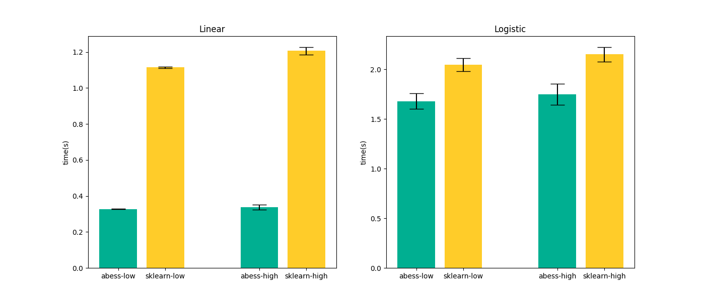

# Power of abess

In this part, we are going to explore the power of the abess package using simulated data. We compare the abess package with popular Python packages: [scikit-learn](https://scikit-learn.org/stable/supervised_learning.html#supervised-learning) for linear and logistic regressions in the following section. Actually, we also compare with [python-glmnet](https://github.com/civisanalytics/python-glmnet), [statsmodels](https://github.com/statsmodels/statsmodels) and [L0bnb](https://github.com/alisaab/l0bnb), but the python-glmnet presents a poor prediction error, the statsmodels runs slow and the L0bnb cannot adaptively choose sparsity level. So their results are not showed here. 

## Simulation

### Setting

Both packages are compared in three aspects including the prediction performance, the variable selection performance, and the computation efficiency. 

- The prediction performance of the linear model is measured by $||y−\hat{y}||_2$ on a test set and for logistic regression this is measured by the area under the ROC Curve (AUC). 
- For the variable selection performance, we compute the coefficient error $||\beta - \hat{\beta}||_2$, true positive rate (TPR, which is the proportion of varibales in the active set that are correctly identified) and the false positive rate (FPR, which is the proportion of the varibales in the inactive set that are falsely identified as a signal). 
- Timings of the CPU execution are recorded in seconds and all the performances are averaged over 100 replications on a sequence of 100 regularization parameters.

The simulated data are made by `abess.datasets.make_glm_data()`. The number of predictors is $p=2000$ and the size of data is $n=500$. The true coefficient contains $k=10$ nonzero entries uniformly distributed in $[b,B]$. For linear (gaussian) data, we set $b = 5\sqrt{2\ln p / n}$ and $B = 100b$. For logistic (binomial) data, we set $b = 10\sqrt{2\ln p / n}$ and $B = 5b$. In each regression, we test for both low ($\rho=0.1$) and high correlation ($\rho=0.7$) scenarios. What's more, a random noise generated from a standard Gaussian distribution is added to the linear predictor $x′β$ for linear regression. 

All experiments are evaluated on an Intel(R) Core(TM) i5-8250U CPU @ 1.60GHz and under Python 3.8.10. 

```bash
$ python abess/docs/example/Python/perform.py
```

### Results

> For linear regression, we compare three methods in the two packages: Lasso, OMP and abess. For logistic regression, we compare two methods: lasso and abess. 

The results are presented in the following pictures. The first column is the result of linear regression and the second one is of logistic regression. 

- Firstly, among all of the methods implemented in different packages, the estimator obtained by the abess package shows both the best prediction performance and the best coefficient error.
- Secondly, the estimator obtained by the abess package can reasonably control FPR in a low level while the TPR stays at 1. (Since all methods' TPR are 1, the figure is not plotted.)
- Furthermore, our abess package is highly efficient compared with other packages, especially in the linear regression. 




### R performance

For R performance, please view [https://abess-team.github.io/abess/articles/v11-power-of-abess.html](https://abess-team.github.io/abess/articles/v11-power-of-abess.html).