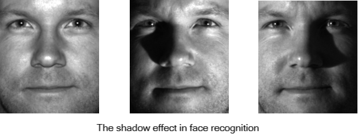

.. DO NOT EDIT.
.. THIS FILE WAS AUTOMATICALLY GENERATED BY SPHINX-GALLERY.
.. TO MAKE CHANGES, EDIT THE SOURCE PYTHON FILE:
.. "auto_gallery\plot_RPCA.py"
.. LINE NUMBERS ARE GIVEN BELOW.

.. only:: html

    .. note::
        :class: sphx-glr-download-link-note

        Click :ref:`here <sphx_glr_download_auto_gallery_plot_RPCA.py>`
        to download the full example code

.. rst-class:: sphx-glr-example-title

.. _sphx_glr_auto_gallery_plot_RPCA.py:

Robust Principal Component Analysis
======================================== 
This notebook introduces what is adaptive best subset selection robust principal component analysis (RobustPCA) and then we show how it works using **abess** package on an artificial example.

.. GENERATED FROM PYTHON SOURCE LINES 8-18

PCA
---------------------------
Principal component analysis (PCA) is an important method in the field of data science, which can reduce the dimension of data and simplify our model. It solves an optimization problem like:

.. math::
    \max_{v} v^T\Sigma v,\qquad s.t.\quad v^Tv=1.

where :math:`\Sigma = X^TX/(n-1)` and :math:`X\in \mathbb{R}^{n\times p}` is the centered sample matrix with each row containing one observation of :math:`p` variables.

.. GENERATED FROM PYTHON SOURCE LINES 20-98

Robust-PCA (RPCA)
-----------------------------------
However, the original PCA is sensitive to outliers, which may be unavoidable in real data:

- Object has extreme performance due to fortuity, but he/she shows normal in repeated test;
- Wrong observation/recording/computing, e.g. missing or dead pixels, X-ray spikes.

In this situation, PCA may spend too much attention on unnecessary variables. 
That's why Robust-PCA (RPCA) is presented, which can be used to recover the (low-rank) sample for subsequent processing.

In mathematics, RPCA manages to divide the sample matrix :math:`X` into two parts: 

.. math::
    X = S + L, 

where :math:`S` is the sparse "outlier" matrix and :math:`L` is the "information" matrix with a low rank. 
Generally, we also suppose :math:`S` is not low-rank and :math:`L` is not sparse, in order to get unique solution.

.. image:: ./images/rpca.png

In Lagrange format, 

.. math::
    \min _{S, L}\|X-S-L\|_{F} \leq \varepsilon, s . t . \quad \operatorname{rank}(L)=r,\|S\|_{0} \leq s

where :math:`s` is the sparsity of :math:`S`.
After RPCA, the information matrix :math:`L` can be used in further analysis.

> Note that it does NOT deal with "noise", which may stay in :math:`L` and need further procession.  

Hard Impute
^^^^^^^^^^^^^^^^^^^
To solve its sub-problem, RPCA under known outlier positions, we follow a process called "Hard Impute".
The main idea is to estimate the outlier values by precise values with KPCA, where :math:`K=r`.

Here are the steps:

1. Input :math:`X, outliers, M, \varepsilon`, where :math:`outliers` records the non-zero positions in :math:`S`; 

2. Denote :math:`X_{\text{new}} \leftarrow {\bf 0}` with the same shape of :math:`X`;

3. For :math:`i = 1,2, \dots, M`:

   - :math:`X_{\text{old}} = \begin{cases} X_{\text{new}},&\text{for } outliers\\X,&\text{for others}\end{cases}`;

   - Form KPCA on :math:`X_{\text{old}}` with :math:`K=r`, and denote :math:`v` as the eigenvectors;

   - :math:`X_{\text{new}} = X_{\text{old}}\cdot v\cdot v^T`;

   - If :math:`\|X_{\text{new}} - X_{\text{old}}\| < \varepsilon`, break;

   End for;

4. Return :math:`X_{\text{new}}` as :math:`L`;

where :math:`M` is the maximum iteration times and :math:`\varepsilon` is the convergence coefficient.

The final :math:`X_{\text{new}}` is supposed to be :math:`L` under given outlier positions.

RPCA Application
^^^^^^^^^^^^^^^^^^^
Recently, RPCA is more widely used, for example,

- Video Decomposition: 
in a surveillance video, the background may be unchanged for a long time while only a few pixels (e.g. people) update. 
In order to improve the efficiency of store and analysis, we need to decomposite the video into background and 
foreground. Since the background is unchanged, it can be stored well in a low-rank matrix, while the foreground, which is 
usually quite small, can be indicated by a sparse matrix. That is what RPCA does.

- Face recognition: 
due to complex lighting conditions, a small part of the facial features may be unrecognized (e.g. shadow).
In the face recognition, we need to remove the effects of shadows and focus on the face data. Actually, since the face data is almost unchanged (for one person), and the shadows affect only a small part, it is also a suitable situation to use RPCA. Here are some examples: 

.. GENERATED FROM PYTHON SOURCE LINES 100-106

Simulated Data Example
-------------------------------------
Fitting model
^^^^^^^^^^^^^^^^^^^^^^^^^^^^^^^^^^^^^^^
Now we generate an example with :math:`100` rows and :math:`100` columns with :math:`200` outliers.
We are looking forward to recover it with a low rank :math:`10`.

.. GENERATED FROM PYTHON SOURCE LINES 106-130

.. code-block:: default

    import numpy as np
    # sphinx_gallery_thumbnail_path = '_static/rpca.png'

    def gen_data(n, p, s, r, seed = 0):
        np.random.seed(seed)
        outlier = np.random.choice(n*p, s, replace=False)
        outlier = np.vstack((outlier//p, outlier%p)).T
        L = np.dot(np.random.rand(n, r), np.random.rand(r, n))
        S = np.zeros((n, p))
        S[outlier[:, 0], outlier[:, 1]] = float(np.random.randn(1)) * 10
        X = L + S
        return X, S

    n = 100     # rows
    p = 100     # columns
    s = 200     # outliers
    r = 10      # rank(L)

    X, S = gen_data(n, p, s, r)
    print(f'X shape: {X.shape}')
    # print(f'outlier: \n{outlier}')

.. rst-class:: sphx-glr-script-out

 Out:

 .. code-block:: none

    X shape: (100, 100)

.. GENERATED FROM PYTHON SOURCE LINES 131-132

In order to use our program, users should call `RobustPCA()` and give the outlier number to `support_size`. Note that it can be a specific integer or an integer interval. For the latter case, a support size will be chosen by information criterion (e.g. GIC) adaptively.

.. GENERATED FROM PYTHON SOURCE LINES 132-138

.. code-block:: default

    from abess.decomposition import RobustPCA
    model = RobustPCA(support_size = s) # support_size can be a interval like `range(s_min, s_max)`

.. GENERATED FROM PYTHON SOURCE LINES 139-140

It is quite easy to fit this model, with `RobustPCA.fit` function. Given the original sample matrix :math:`X` and :math:`rank(L)` we wnat, the program will give a result quickly.

.. GENERATED FROM PYTHON SOURCE LINES 140-143

.. code-block:: default

    model.fit(X, r = r) # r=rank(L)

.. rst-class:: sphx-glr-script-out

 Out:

 .. code-block:: none

    RobustPCA(always_select=[], support_size=200)

.. GENERATED FROM PYTHON SOURCE LINES 144-145

Now the estimated outlier matrix is stored in `model.coef_`.

.. GENERATED FROM PYTHON SOURCE LINES 145-151

.. code-block:: default

    S_est = model.coef_
    print(f'estimated sparsity: {np.count_nonzero(S_est)}')

.. rst-class:: sphx-glr-script-out

 Out:

 .. code-block:: none

    estimated sparsity: 200

.. GENERATED FROM PYTHON SOURCE LINES 152-155

More on the result
^^^^^^^^^^^^^^^^^^^^^^^^^^^^^^^^^^^^^^
To check the performance of the program, we use TPR, FPR as the criterion.

.. GENERATED FROM PYTHON SOURCE LINES 155-175

.. code-block:: default

    def TPR(pred, real):
        TP = (pred != 0) & (real != 0)
        P = (real != 0)
        return sum(sum(TP)) / sum(sum(P))

    def FPR(pred, real):
        FP = (pred != 0) & (real == 0)
        N = (real == 0)
        return sum(sum(FP)) / sum(sum(N))

    def test_model(pred, real):
        tpr = TPR(pred, real)
        fpr = FPR(pred, real)
        return np.array([tpr, fpr])

    print(f'[TPR  FPR] = {test_model(S_est, S)}')

.. rst-class:: sphx-glr-script-out

 Out:

 .. code-block:: none

    [TPR  FPR] = [0.925      0.00153061]

.. GENERATED FROM PYTHON SOURCE LINES 176-177

We can also change different random seed to test for more situation:

.. GENERATED FROM PYTHON SOURCE LINES 177-189

.. code-block:: default

    M = 30  # use 30 different seed
    res = np.zeros(2)
    for seed in range(M):
        X, S = gen_data(n, p, s, r, seed)
        model = RobustPCA(support_size=s).fit(X, r=r)
        res += test_model(model.coef_, S)

    print(f'[TPR  FPR] = {res/M}')

.. rst-class:: sphx-glr-script-out

 Out:

 .. code-block:: none

    [TPR  FPR] = [0.89866667 0.00206803]

.. GENERATED FROM PYTHON SOURCE LINES 190-191

Under all of these situations, `RobustPCA` have a good performance.

.. rst-class:: sphx-glr-timing

   **Total running time of the script:** ( 0 minutes  1.247 seconds)

.. _sphx_glr_download_auto_gallery_plot_RPCA.py:

.. only :: html

 .. container:: sphx-glr-footer
    :class: sphx-glr-footer-example

  .. container:: sphx-glr-download sphx-glr-download-python

     :download:`Download Python source code: plot_RPCA.py <plot_RPCA.py>`

  .. container:: sphx-glr-download sphx-glr-download-jupyter

     :download:`Download Jupyter notebook: plot_RPCA.ipynb <plot_RPCA.ipynb>`

.. only:: html

 .. rst-class:: sphx-glr-signature

    `Gallery generated by Sphinx-Gallery <https://sphinx-gallery.github.io>`_
